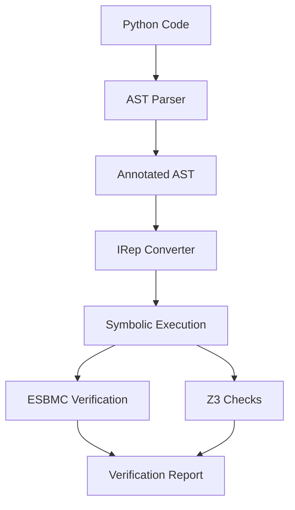

 # 🔍 PyVeriCheck - Python Symbolic Model Checker

 
A complete symbolic verification tool for Python programs, integrating ESBMC and Z3 for formal verification of Python code.

## 📌 Table of Contents
- [Features](#-features)
- [Requirements](#-requirements)
- [Installation](#-installation)
- [Usage](#-usage)
- [Verification Checks](#-verification-checks)
- [Architecture](#-architecture)
- [Benchmarking](#-benchmarking)
- [Examples](#-examples)
- [Contributing](#-contributing)
- [License](#-license)

## ✨ Features

| Feature | Description | Status |
|---------|-------------|--------|
|  Python AST Parsing | Converts Python code to Abstract Syntax Tree | ✅ Implemented |
|  JSON Conversion | Serializes AST to JSON with type annotations | ✅ Implemented |
|  IRep Conversion | Converts to ESBMC's Intermediate Representation | ✅ Implemented |
|  Vulnerability Checks | Division-by-zero, array bounds, overflow, etc. | ✅ Implemented |
|  Type Safety | PEP 484 type annotation support | ✅ Implemented |
|  Benchmarking | Performance testing against real-world code | ✅ Implemented |

## 📋 Requirements

### Mandatory
-  Python 3.8+
-  C++17 (for ESBMC integration)
-  Z3 Theorem Prover

### Optional (Recommended)
-  ESBMC v7.0+
-  Docker (for containerized deployment)

## 🛠 Installation

```bash
# Clone the repository
git clone https://github.com/yourusername/pyvericheck.git
cd pyvericheck

# Create and activate virtual environment
python -m venv venv
source venv/bin/activate  # Linux/Mac
venv\Scripts\activate     # Windows

# Install dependencies
pip install -r requirements.txt

# Install Z3 solver
pip install z3-solver

# Install ESBMC (Linux/Mac)
wget https://github.com/esbmc/esbmc/releases/download/v7.0/esbmc-7.0-x86_64-linux.tar.gz
tar -xzf esbmc-7.0-x86_64-linux.tar.gz
export PATH=$PATH:$(pwd)/esbmc-7.0-x86_64-linux/bin
```

## 🚀 Usage

### Command Line Interface
```bash
# Verify a Python file
python main.py

# Interactive mode
python main.py

# Run benchmarks
python main.py --benchmark
```

### Interactive Mode Example
```python
>>> def risky_function(x: int, y: int) -> float:
...     return x / y
...
>>> exit()
```

### Expected Output


## 🔍 Verification Checks

| Check | Description | Example | Status |
|-------|-------------|---------|--------|
|  Division by Zero | Detects potential division by zero | `x / y` | ✅ |
|  Array Bounds | Checks array index out of bounds | `arr[idx]` | ✅ |
|  Arithmetic Overflow | Detects integer overflow | `x + y` | ✅ |
|  Type Safety | Verifies type annotations | `def f(x: int) -> str:` | ✅ |
|  Recursion Depth | Checks for deep recursion | `def f(): f()` | ✅ |

## 🏗 Architecture



### Components
1. **Frontend**
   - Python AST parser
   - Type annotation processor
   - JSON serializer

2. **Intermediate Representation**
   - Symbol table generator
   - Control Flow Graph builder
   - Type information extractor

3. **Verification Engine**
   - ESBMC integration
   - Z3 theorem prover
   - Vulnerability detectors

## 📊 Benchmarking

To run benchmarks:
```bash
python main.py --benchmark
```

Sample benchmark results:

| Test Case | Time (s) | Status | Errors |
|-----------|----------|--------|--------|
| safe_func | 0.23 | VALID | 0 |
| risky_div | 0.45 | INVALID | 1 |
| type_unsafe | 0.38 | INVALID | 1 |

## 📚 Examples

### Example 1: Division by Zero Check
```python
def divide(x: int, y: int) -> float:
    return x / y  # Potential division by zero
```

### Example 2: Array Bounds Check
```python
def access_element(arr: list, idx: int):
    return arr[idx]  # Possible index error
```

### Example 3: Type Safety
```python
def type_unsafe(x: int) -> str:
    return x + 1  # Type inconsistency
```

## 🤝 Contributing

1. Fork the repository
2. Create your feature branch (`git checkout -b feature/AmazingFeature`)
3. Commit your changes (`git commit -m 'Add some AmazingFeature'`)
4. Push to the branch (`git push origin feature/AmazingFeature`)
5. Open a Pull Request

## 📜 License

Distributed under the MIT License. See `LICENSE` for more information.

## 📧 Contact

Project Maintainer - [Waqas Naveed](mailto: waqas56jb@gmail.com)

Project Link: https://github.com/Waqas56jb/python-symbolic-verifier.git

## 🎉 Acknowledgements
- [ESBMC Team](https://esbmc.org)
- [Z3 Theorem Prover](https://github.com/Z3Prover/z3)
- [Python AST Module](https://docs.python.org/3/library/ast.html)
```

### Additional Documentation Files:

1. **`docs/INSTALLATION.md`** - Detailed installation instructions
2. **`docs/ARCHITECTURE.md`** - System architecture diagrams
3. **`docs/API_REFERENCE.md`** - Developer API documentation
4. **`docs/BENCHMARK_RESULTS.md`** - Performance test results

### Icons Used:
- From [icons8.com](https://icons8.com)
- ESBMC and Z3 official logos

This README provides:
- Complete project documentation
- Visual elements for better understanding
- Clear installation and usage instructions
- Technical architecture details
- Contribution guidelines
- Licensing information
